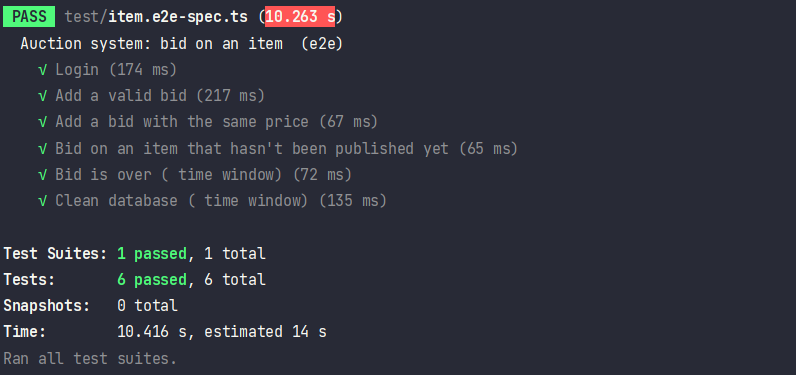
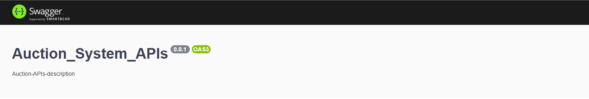
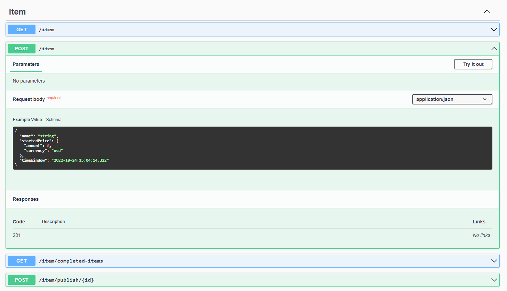

<p align="center"> <a >An Auction System </a> Backend with <a >NestJS</a> as a NodeJS framework   and <a>MongoDB</a> for a Database.</p>
    <p align="center">

</p>

## Description

Online auction system where users can create and bid on items..

## Setup
### Installation

```bash
$ npm install
```

### Running the app

```bash
# development
$ npm run start

# watch mode
$ npm run start:dev

# production mode
$ npm run start:prod
```

### Test

```bash

# e2e tests
$ npm run test:e2e

```
> **NOTE :**  I particularly allowed .env file in this repo on purpose to make it simpler for the reviewer to run


# Details
## Structure
#### The backend consists of 3 Modules :

- Auth module responsible for login and sign up user , compares the user's information against entries in a database to meet the authentication criteria.
- User module responsible for profile management.
- Item module than contains the logic of the application , auction system , item creation and bid scenarios.
> **NOTE :**  The user deposit the money in the request handler and later will be handled by a third party payment service along with currencies exchange

## Abstract Concept

- Even though it's a prototype-oriented  TypeScript, most of the elements are based on objects, and it utilizes Object-Oriented Programming (OOP) in its own ways.

- So an abstract module is implemented containing an abstract controller, Service (contains methods), and Schema.

- All modules inherit from abstract module to use common methods that will always be improved and modified with time in  order to have less  , clearer and readable code.

## Queues using Redis 

When the time window expires and the bid is over an automatic task have to update item status to completed
- Deployed a Redis database in the cloud (link in .env file)
- Implemented bull Queuing for the job in Item module

## E2E Testing

- A test suit for item is implemented to test the bid scenarios (most of the logic for auction)
- The rest of the test will be the same 
- In the future, we can change testing in mongo in memory
```bash
$ npm run test:e2e
```
####  Output :

<p align="center">
  <a href="http://nestjs.com/" target="blank"></a>
</p>

## Swagger
When the server is running open it localhost on the running port ( localhost:3000/docs ) to find swagger documentation :

<p align="center">
  <a href="http://nestjs.com/" target="blank"></a>
</p>
Find all APIs with examples in the body:
<p align="center">
  <a href="http://nestjs.com/" target="blank"></a>
</p>

## Have a great weekend, I'm looking forward to meeting you !
